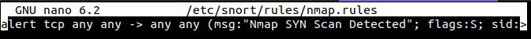
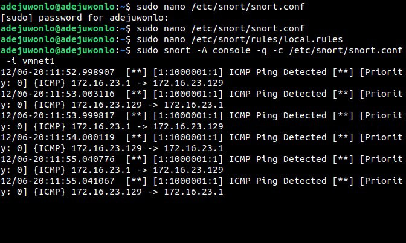
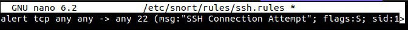
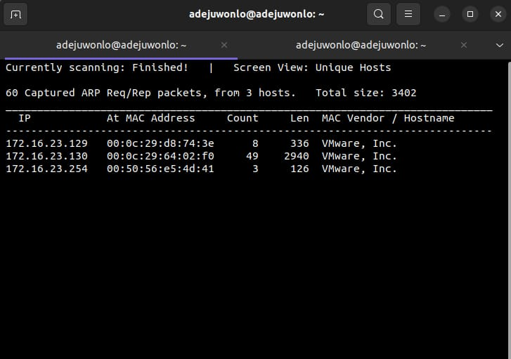
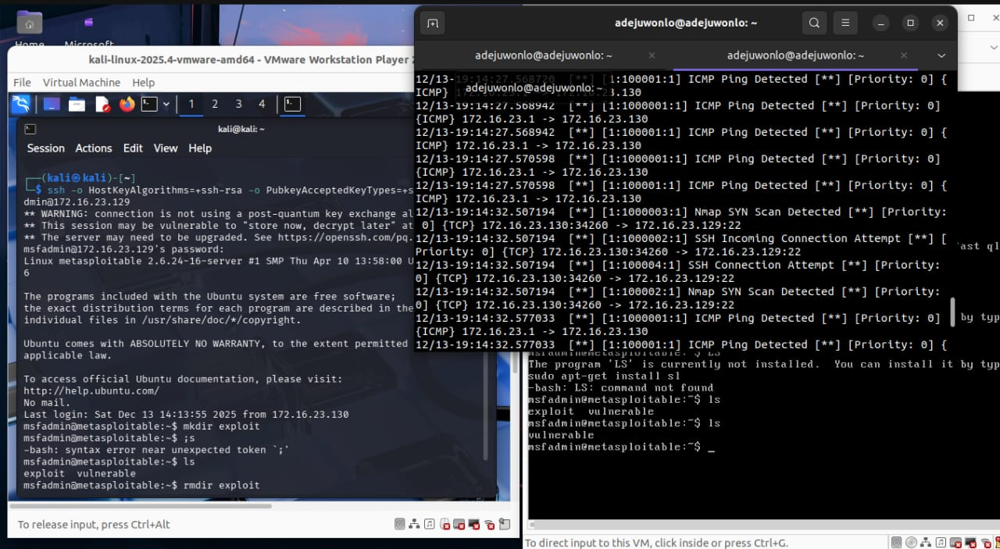
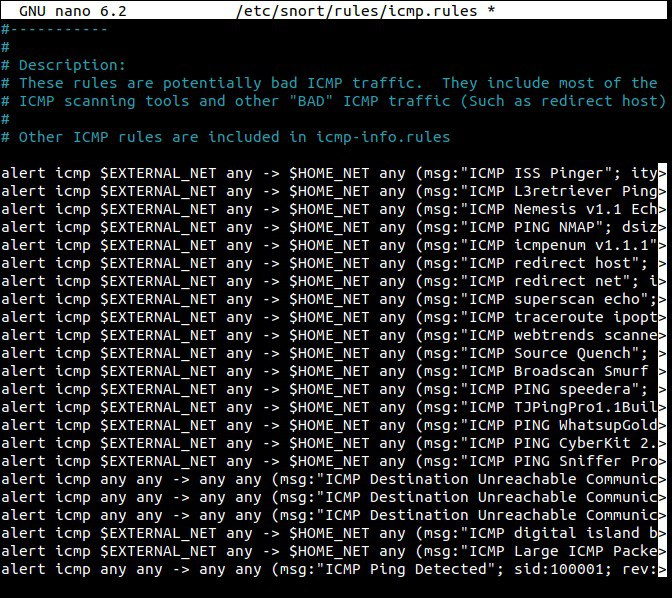
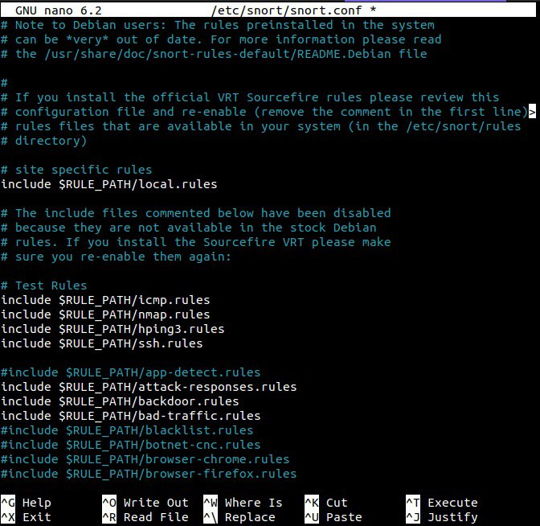
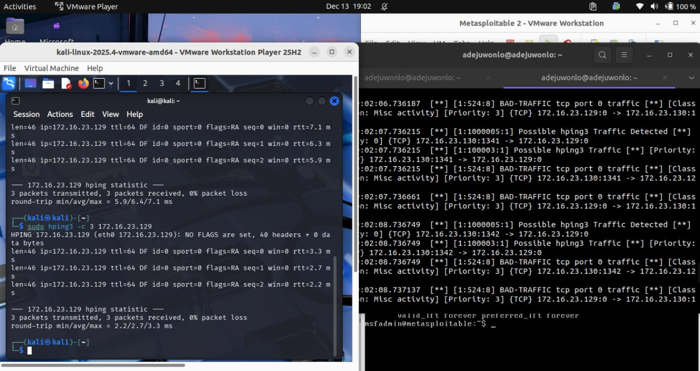
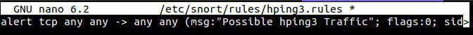

**Assets:**
1. **Defender (Sensor):** Ubuntu Host (Snort IDS)  
2. **Attacker:** Kali Linux  
3. **Target:** Metasploitable 2 (Vulnerable Linux Target)  
   

## **1\. Overview**

This report outlines the successful deployment, configuration, and testing of the Snort Intrusion Detection System (IDS) within a controlled, isolated  environment. The assessment utilized a 3-device topology (Attacker, Defender, Target) to simulate a network attack scenario.  
The primary objective was to configure the Ubuntu Defender to passively monitor network traffic and detect malicious activities directed at the Metasploitable target. The assessment confirms that the Snort sensor successfully identified all simulated threat vectors, including ICMP probing, Port Scanning (Nmap), Denial of Service flooding (hping3), and Unauthorized Access attempts (SSH).

## **2\. Laboratory Environment Setup**

### **2.1 Virtual Machine Configuration and Network Topology**

**Virtual Machine Installation:** The lab environment was constructed using three distinct virtual machines running on a standard hypervisor (VMware Workstation/VM Player).

1. **Attacker:** Kali Linux was deployed to generate malicious traffic.  
2. **Defender:** Ubuntu Linux was configured as the passive network sensor running Snort.  
3. **Target:** Metasploitable 2 was deployed as the victim system.

**Network Configuration:** Crucially, all three devices were configured on the same virtual network segment. To ensure the Ubuntu Defender could analyze traffic flowing between the Attacker and the Target.

### **2.2 IP Address Discovery**

The IP address of the target machine was identified using netdiscover on the Ubuntu scanning platform.   
**Command Used (Ubuntu Terminal):**  
sudo netdiscover \-r 172.16.23/24  
The execution of this command successfully identified the active host corresponding to the Metasploitable 2 and Kali VM.  
  
**Fig 1\. Netdiscover discovers IP addresses on the network**

## 

## 

## **3\. Snort Installation and Rule Configuration**

### **3.1 Installation Procedure**

The Snort IDS engine was installed directly on the Ubuntu Defender machine to act as the primary sensor. **Command Used:**  
sudo apt-get update  
sudo apt-get install snort

### **3.2 Configuration (snort.conf)**

The main configuration file /etc/snort/snort.conf was modified to define the operational parameters:

1. **Network Definition:** The HOME\_NET variable was updated to match the lab subnet ensuring Snort could distinguish between internal and external traffic.  
2. **Rule Management:** To ensure modularity and ease of troubleshooting, four distinct rule files were created and included in the configuration.

  
**Fig 2\. Configuring Snort Rules**

### 

### **3.3 Custom Rule Development**

Specific detection rules were authored to identify the required threat vectors. These were saved in **/etc/snort/rules/.**

| Rule File | Detection Objective | Rule Syntax |
| :---- | :---- | :---- |
| **icmp.rules** | Detect Ping Sweeps | alert icmp any any \-\> any any (msg:"ICMP Ping Detected"; sid:100001; rev:1;) |
| **nmap.rules** | Detect SYN Scans | alert tcp any any \-\> any any (msg:"Nmap SYN Scan Detected"; flags:S; sid:100002; rev:1;) |
| **hping3.rules** | Detect DoS Traffic | alert tcp any any \-\> any any (msg:"Possible hping3 Traffic"; flags:0; sid:100003; rev:1;) |
| **ssh.rules** | Detect SSH Connections | alert tcp any any \-\> any 22 (msg:"SSH Connection Attempt"; flags:S; sid:100004; rev:1;) |

**icmp rules.**

**ssh rules.**

**hping3 rules.**

**nmap rules.**

## **4\. Threat Simulation and Detection Findings**

This section details the attack vectors executed by the Kali machine and the corresponding alerts generated by the Snort Sensor.

### **4.1 Threat: ICMP Network Probing**

**Attack Vector:** A ping was initiated from the attack system to test connectivity to the target.

1. **Command (Kali):** ping \-c 3 172.16.23.129  
2. **Detection Status:** **SUCCESS**  
3. **Snort Log Output:** The console displayed "ICMP Ping Detected" for each echo request packet.

### 

**Fig 3\. Snort detects ICMP ping**

### 

### **4.2 Threat: Nmap Port Scanning**

**Attack Vector:** Nmap used with the SYN flag (-sS) to perform a stealthy port scan, attempting to identify open ports without completing the TCP handshake.

1. **Command (Kali):** sudo nmap \-sS 172.16.23.129  
2. **Detection Status:** **SUCCESS**  
3. **Snort Log Output:** Snort correctly identified the specific flag pattern (flags:S) and alerted "Nmap SYN Scan Detected".

**Fig 4\. Snort Discovers Nmap Scan**

### 

### **4.3 Threat: Denial of Service Simulation (hping3)**

**Attack Vector:** hping3 was used to generate crafted TCP packets with abnormal flags (Null), simulating a flood or DoS precursor attack.

1. **Command (Kali):** sudo hping3 \-c 3 172.16.23.129  
2. **Detection Status:** **SUCCESS**  
3. **Snort Log Output:** The rule triggering on flags:0 successfully caught the traffic, displaying "Possible hping3 Traffic".

**Fig 5\. Snort Detects hping3 traffic**

### 

### **4.4 Threat: Unauthorized Remote Access (SSH)**

**Attack Vector:** An attempt was made to initiate a remote shell session using the SSH protocol.

1. **Command (Kali):** ssh \-o HostKeyAlgorithms=+ssh-rsa Type msfadmin@172.16.23.129  
2. **Detection Status:** **SUCCESS**  
3. **Snort Log Output:** Snort detected the TCP handshake and issued the alert "SSH Connection Attempt".

**![][image10]**

**Fig 6\. Snort Detects SSH connection attempts**

## 

## **5\. Critical Analysis of IDS Effectiveness**

### **5.1 Effectiveness of Signature-Based Detection**

The assessment demonstrated the use of Snort's for detecting known attack patterns with low latency.

### **5.2 Limitation: Detection vs. Prevention**

In this configuration, Snort operated as an Intrusion Detection System (IDS). While it successfully logged the malicious activities, it did not stop them. The ICMP packets and SSH connection attempts reached the target successfully. To actively block these threats, the system would need to be reconfigured as an Intrusion Prevention System (IPS), operating inline to drop packets matching the malicious rules.

## **6\. Conclusion and Recommendations**

The implementation of Snort IDS on the Ubuntu platform provided comprehensive visibility into network attacks directed at the target system. All defined threat vectors were successfully detected.

1. **Strategic Recommendations:**  
2. **Transition to IPS:** For production environments, it is recommended to transition from detection (alerting) to prevention (blocking) to actively mitigate threats.  
3. **Rule Optimization:** The current rules utilized any \-\> any for demonstration purposes. Future configurations should restrict rules to specific external-to-internal traffic flows to reduce false positives.  
4. **Log Integration:** Integrating Snort logs with a SIEM solution is recommended for long-term historical analysis and correlation.