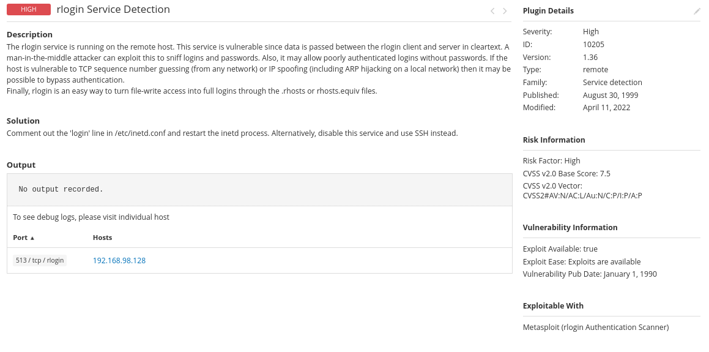
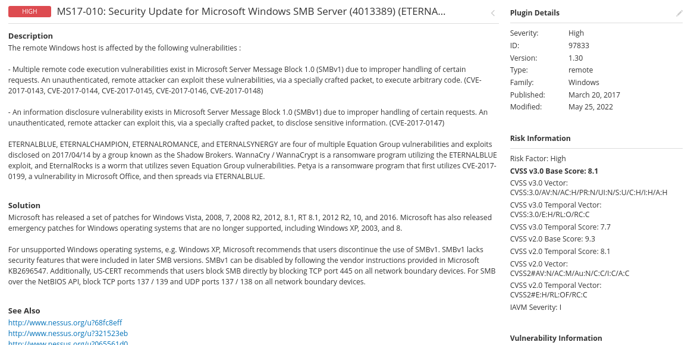
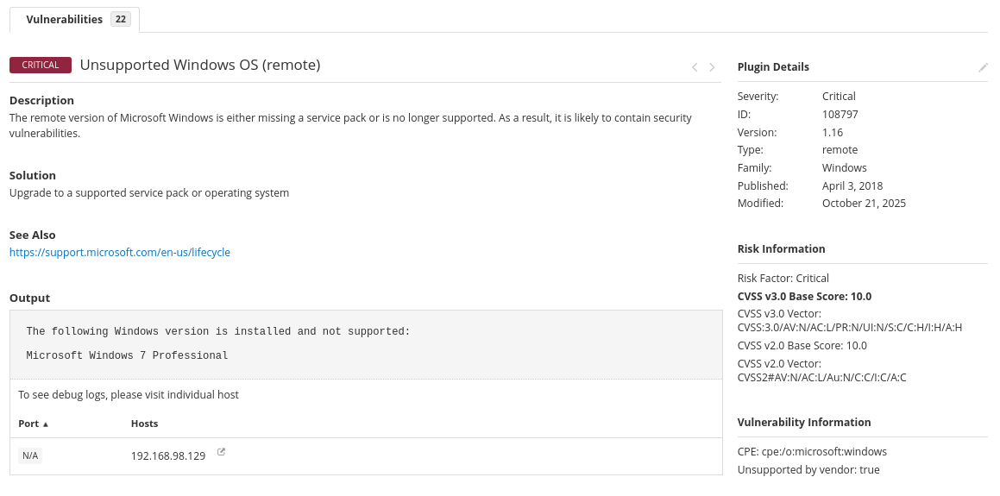
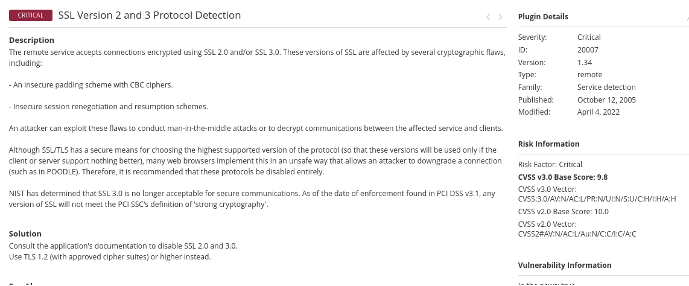
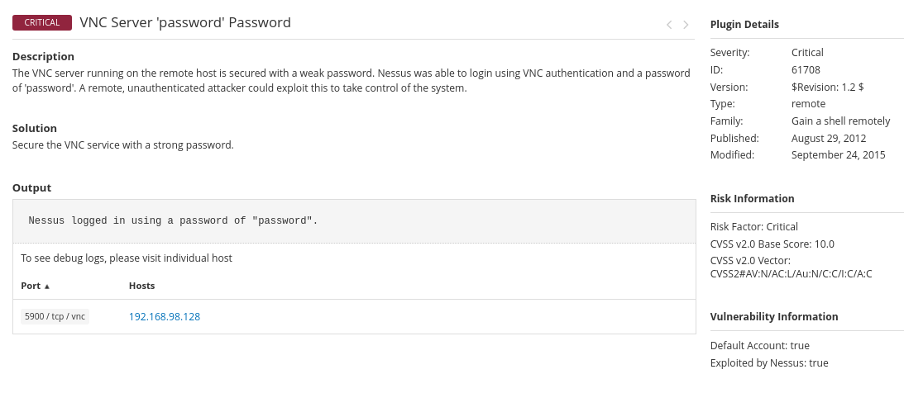

**Assets:** 
1.  **Metasploitable 2:** 192.168.98.128 (Linux-based)  
2. **Windows 7 Professional:** 192.168.98.129 (Legacy Microsoft OS)  
3.  **Ubuntu** (Test Environment)  
   

### **1\. Overview**

This report outlines the critical findings from a comprehensive vulnerability assessment conducted on two isolated internal test systems. The assessment utilized the industry-leading scanning tools **Tenable Nessus**.  
The overall security posture of both targets is rated as **Critical**. The findings highlight severe, unmitigated risks that would lead to immediate remote code execution (RCE) and system compromise if these assets were deployed in a production environment and require immediate and mandatory action to address and eliminate 

### **2\. Metasploitable 2 Assessment (192.168.98.128)**

#### **2.1 Virtual Machine Setup, Installation, and Network Discovery**

**Virtual Machine Installation:** The Metasploitable 2 operating system was installed as a virtual machine (VM) using a standard hypervisor (e.g., VirtualBox or VMware). This system is a deliberately vulnerable Linux distribution designed to train security professionals. For security and control, the VM was configured to operate within a strictly isolated, internal virtual network segment.  
**Network Configuration for Scanning:** Crucially, the Ubuntu scanning machine and the Metasploitable 2 target VM were configured to share the same Host-Only or NAT Network virtual segment (i.e., the 192.168.98.0/24 subnet). This ensures Layer 2/3 connectivity between the scanner and the target, which is essential for successful host discovery and active scanning.  
**IP Address Discovery:** The IP address of the Metasploitable 2 VM (192.168.98.128) was determined using the fping utility from the Ubuntu scanning platform. fping is a high-performance tool used to send parallel ICMP echo requests across a defined range of IP addresses, quickly identifying live hosts available on the local subnet.  
**Command Used (Ubuntu Terminal):**  
Using fping to scan the entire C-class subnet for live hosts.  
*$ fping \-a \-g 192.168.98.0/24*  
The successful execution of this command returned the active host at **192.168.98.128**.

### **2.2  Nessus Essentials Installation and Scan Procedure**

**Installation Method (Ubuntu Terminal):** The Nessus Essentials scanner was installed directly on the Ubuntu machine. This involved downloading the official Debian package (.deb) and managing the service via the system's package manager and systemctl.

1. Install required packages  
   *$ sudo apt update*  
   *$ sudo apt install \-y curl*  
2.  Install the Nessus package using dpkg  
   *$ sudo dpkg \-i Nessus-\[version\_and\_arch\].deb*  
3. Start the Nessus service to begin initialization  
   *$ sudo /bin/systemctl start nessusd.service*

**Nessus Scan Initiation and Review:**

1. **Access UI:** We navigated to the Nessus web interface URL: https://127.0.0.1:8834.  
2. **Start Scan:** From the main dashboard, the **"New Scan"** button was clicked to initiate the wizard.  
3. **Select Policy:** The **"Basic Network Scan"** template was selected. This comprehensive, unauthenticated scan profile is sufficient for identifying network-accessible services and common vulnerabilities.  
4. **Configure Target:** Under the "Settings" section, a name ("Metasploitable 2 Scan") was provided, and the target IP address was meticulously entered into the "Targets" field: **192.168.98.128**.  
5. **Launch and Monitor:** The configuration was saved, and the scan was initiated by clicking **"Launch"**. Scan progress was tracked on the **"My Scans"** page.  
6. **Review Report:** Upon completion (Status: **"Completed"**), the scan entry was opened. The **"Vulnerabilities"** tab provided a categorized breakdown of the 67 detected flaws, categorized by severity (Critical, High, Medium, etc.) .

### **2.3 Vulnerabilities and Mitigation Analysis (Metasploitable 2\)**

**Fig 1.1**  
**Vulnerability**: UnrealIRCd Backdoor Detection  
**Severity CVSS v3.0:** CRITICAL 10.0  

**Description and Impact:** This is a highly critical flaw where the running UnrealIRC daemon (version 1.16 was detected) contains a deliberate backdoor (CVE-2010-2072). An unauthenticated attacker can execute arbitrary code on the system with the privileges of the service account, which, on this system, is often root.  
**Mitigation Strategy** Immediate Service Removal: The UnrealIRCd package must be immediately uninstalled using the package manager (apt-get purge unrealircd). If IRC functionality is absolutely required, a different, verifiable, and modern IRC daemon should be installed, configured securely, and kept rigorously patched.

**Fig 1.2**  
**Vulnerability**: VNC Server 'password' Password  
**Severity CVSS v3.0:** CRITICAL 10.0  
  
**Description and Impact:** The VNC server running on the remote host is secured with a weak password. Nessus was able to login using VNC authentication and a password of 'password'. A remote, unauthenticated attacker could exploit this to take control of the system.  
**Mitigation Strategy:** The VNC server password must be changed from the default/weak 'password' to a complex, unique password adhering to a strong password policy (minimum 16 characters, including mixed case, numbers, and symbols).

**Fig 1.3**  
**Vulnerability**: SSL Version 2 and 3 Protocol Detection  
**Severity CVSS v3.0:** CRITICAL 9.8  
  
**Description and Impact:** Although SSL/TLS has a secure means for choosing the highest supported version of the protocol (so that these versions will be used only if the client or server support nothing better), many web browsers implement this in an unsafe way that allows an attacker to downgrade a connection (such as in POODLE). Therefore, it is recommended that these protocols be disabled entirely.  
**Mitigation Strategy:** Eliminate the vulnerable protocols entirely. Disable Weak Protocols: Configure all server-side services (e.g., Apache, Nginx, or any service exposing these protocols) to explicitly disable support for SSLv2 and SSLv3. The system should be mandated to use only modern, secure versions of the protocol, such as TLS 1.2 and TLS 1.3.

**Fig 1.4**  
**Vulnerability**: rlogin Service Detection  
**Severity CVSS v3.0:** HIGH 7.5  
  
**Description and Impact:** The rlogin service is running on the remote host. This service is vulnerable since data is passed between the rlogin client and server in cleartext. A man-in-the-middle attacker can exploit this to sniff logins and passwords. Also, it may allow poorly authenticated logins without passwords. If the host is vulnerable to TCP sequence number guessing (from any network) or IP spoofing (including ARP hijacking on a local network) then it may be possible to bypass authentication.  
**Mitigation Strategy:** Immediately disable and remove the rlogin service from the host using the package manager. Replace rlogin with Secure Shell (SSH) for all remote command line access. SSH encrypts all session data, including credentials, protecting against sniffing and man-in-the-middle attacks.

## 

## **3\. Windows 7 Assessment (192.168.98.129)**

### **3.1 Virtual Machine Setup, Installation, and Network Discovery**

**Virtual Machine Installation:** The Windows 7 Professional VM was installed using a legacy image. Like the Metasploitable 2 system, it was configured on the same isolated virtual network segment to ensure the Ubuntu scanner could reach it. This configuration isolates the unsupported OS from the company's production network.  
**IP Address Discovery:** The IP address of the Windows 7 VM (192.168.98.129) was identified using the netdiscover utility on the Ubuntu scanning machine. netdiscover operates by sending out ARP requests and passively sniffing the local network traffic to map active hosts, which is highly effective for discovering targets on a local subnet.  
**Command Used (Ubuntu Terminal):**  
Scanning the network interface for active hosts using netdiscover  
*$ sudo netdiscover \-r 192.168.98.0/24*  
This command successfully identified the active host corresponding to the Windows 7 VM at **192.168.98.129**.

### **3.2 Scanning Tools Installation and Detailed Usage Procedures**

The installation and access methods for Nessus and OpenVAS were identical to those described in Section 2.2. The only variable changed was the target IP address in the scan configuration interfaces.  
**Nessus Target Configuration:** 192.168.98.129

### **3.3 Vulnerabilities and Mitigation Analysis (Windows 7\)**

**Fig 2.1**  
**Vulnerability**: Unsupported Windows OS (remote)  
**Severity CVSS v3.0:** CRITICAL 10.0

**Description and Impact:** The remote version of Microsoft Windows is either missing a service pack or is no longer supported. As a result, it is likely to contain security vulnerabilities.  
**Mitigation Strategy:** Due to the End-of-Life (EOL) status, the Windows 7 Professional operating system no longer receives security updates or vendor support from Microsoft. This system presents an unmitigable risk and must be immediately removed from the network and decommissioned.

**Fig 2.2**  
**Vulnerability**: MS11-030: Vulnerability in DNS Resolution Could Allow Remote Code Execution (2509553) (remote check)  
**Severity CVSS v3.0:** CRITICAL 10.0\*  
  
**Description and Impact:** A flaw in the way the installed Windows DNS client processes Link- local Multicast Name Resolution (LLMNR) queries can be exploited to execute arbitrary code in the context of the NetworkService account.  
**Mitigation Strategy:** Install the Microsoft Security Update MS11-030 (KB2509553). If patching is not an immediate option, disable the Link-Local Multicast Name Resolution (LLMNR) protocol via Group Policy or local registry settings to prevent the exploitation of this client-side vulnerability.

**Fig 2.3**  
**Vulnerability**: MS17-010: Security Update for Microsoft Windows SMB Server (4013389)   
**Severity CVSS v3.0:** HIGH 8.1  
  
**Description and Impact:** Multiple remote code execution vulnerabilities exist in Microsoft Server Message Block 1.0 (SMBv1) due to improper handling of certain requests. An unauthenticated, remote attacker can exploit these vulnerabilities, via a specially crafted packet, to execute arbitrary code. (CVE-2017-0143, CVE-2017-0144, CVE-2017-0145, CVE-2017-0146, CVE-2017-0148)  
**Mitigation Strategy:** Install the Microsoft Security Update MS17-010 (KB4013389) immediately, and then disable the SMBv1 protocol entirely via registry settings or Group Policy to prevent future exploitation.

## **4\. Conclusion and Strategic Next Steps**

The findings of this vulnerability assessment confirm the successful identification of multiple critical flaws across the test infrastructure. The continued existence of an EOL operating system presents the single greatest, unmitigable risk identified.

### **4.1 Recommended Action Plan and Risk Remediation**

The following phased action plan is recommended for immediate implementation:

1. **Phase I: Critical and Urgent Remediation**  
   1. **Windows 7 Decommissioning:** The system at 192.168.98.129 must be removed from the network immediately. If data retrieval is required, place the VM in a temporary quarantine network without network access.  
   2. **Insecure Service Mitigation:** Globally disable and/or remove the following cleartext services across all legacy internal devices: rlogin, rexec, Telnet, and FTP.  
   3. **SMBv1 Prohibition:** Enforce configuration controls to disable the SMBv1 protocol across all internal network assets to eliminate the MS17-010 (EternalBlue) risk.  
2. **Phase II: Strategic and Policy Alignment**  
   1. **OS Lifecycle Policy:** Formalize and strictly enforce a policy that mandates the retirement of operating systems before they reach their official End-of-Life date, ensuring continuous vendor support and patching.  
   2. **Secure Protocol Migration:** Mandate the exclusive use of encrypted protocols, specifically **SSH** and **SFTP**, for all remote administration and file transfer tasks, eliminating the threat of cleartext credential exposure.  
   3. **Firewall Hardening Standard:** Integrate controls into the standard build process for all endpoints to block non-essential ports, including **UDP 5355** and other reconnaissance-friendly ports like **TCP 135** (DCE/RPC).  
3. **Phase III: Vulnerability Management Process Integration**  
   1. **Scheduled Scanning:** Integrate regular, authenticated vulnerability scans using Nessus and OpenVAS into the SOC's standard operating procedures, running comprehensive scans on all production assets at least monthly.  
   2. **Configuration Audit:** Conduct a follow-up audit across the production network to identify and remediate any instances of overly permissive "world readable" file share configurations (NFS, Samba) to enforce the principle of least privilege.